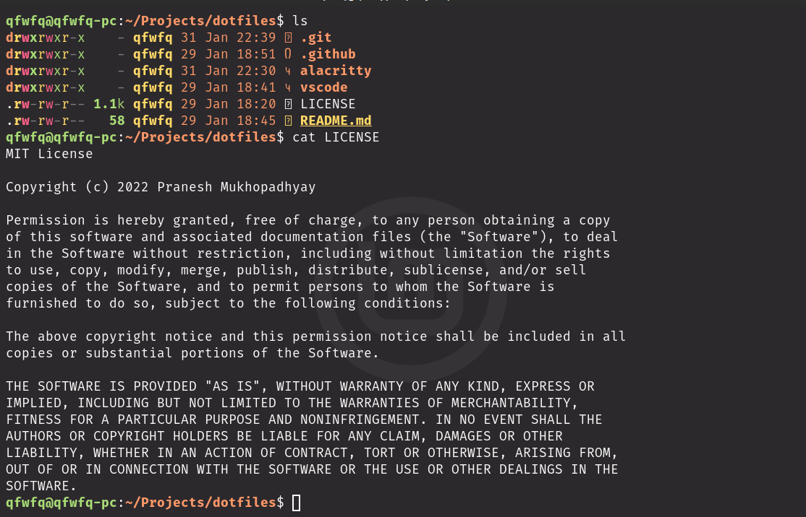

## `alacritty` config

Following is what the alacritty should look like after using this `.alacritty.yml`

This config requires the following font.
[Fira Code](https://github.com/tonsky/FiraCode) [[Download]](https://github.com/tonsky/FiraCode/releases/download/6.2/Fira_Code_v6.2.zip)
