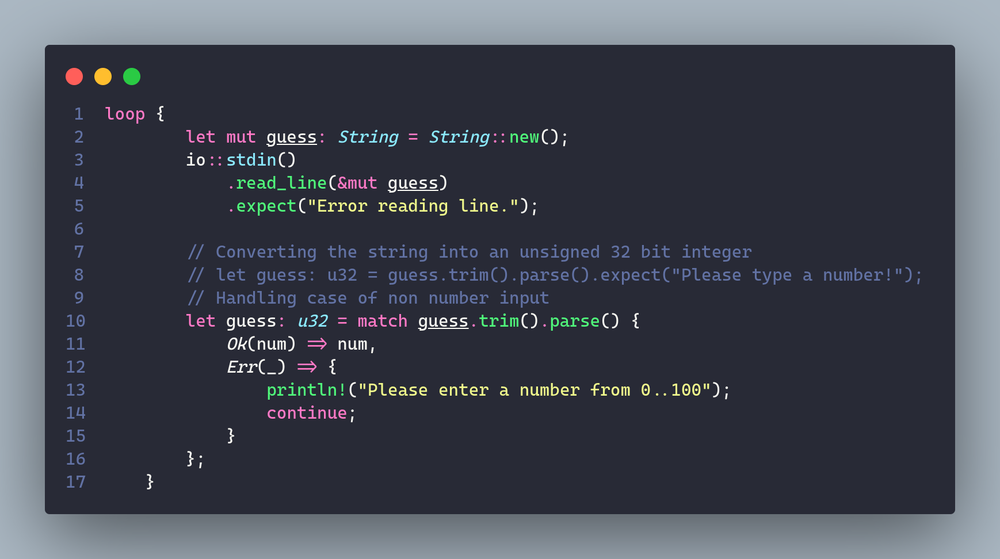

## `vscode` config

Following is what the vscode should look like after using this `settings.json`

The font dependency for this setting is:

- [Fira Code](https://github.com/tonsky/FiraCode) [[Download]](https://github.com/tonsky/FiraCode/releases/download/6.2/Fira_Code_v6.2.zip)
- [Fira Code iScript](https://github.com/kencrocken/FiraCodeiScript)

The default telemetry (data collection), and experimental features are disabled in this config, for further information, please refer to [this](https://code.visualstudio.com/docs/getstarted/telemetry) page.